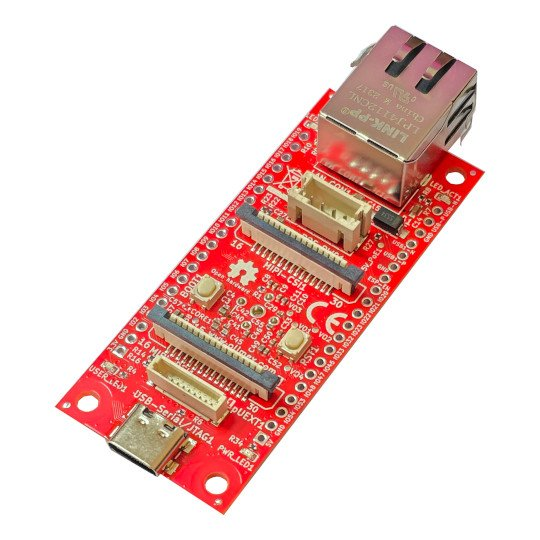
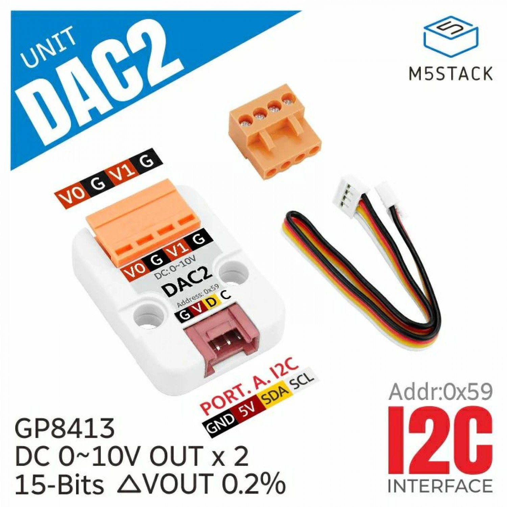
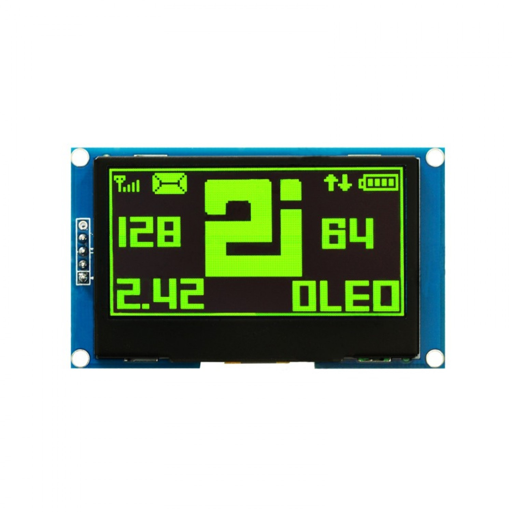
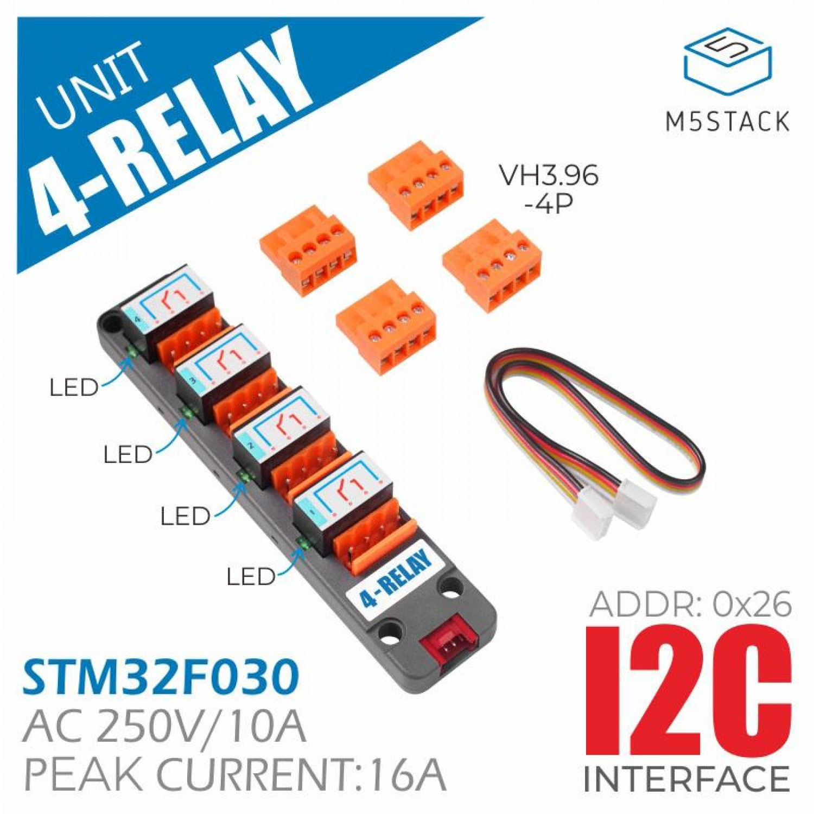

# ESP32P4 dev board

### The hardware



This is the ESP32P4 Ethernet board I am working with



The DAC2 (10 Volt dual channel high resolution)



The i2c Relay board (4 channel)



### external links 


- esp32 board : https://www.olimex.com/Products/IoT/ESP32-P4/ESP32-P4-DevKit/open-source-hardware
- dac 2 : DAC 2 I2C Unit (GP8413) https://shop.m5stack.com/products/m5stickc-dac-2-hat-gp8413
- display : ssd 1306, tinytronics : https://www.tinytronics.nl/nl/displays/oled/2.42-inch-oled-display-128*64-pixels-groen-i2c
- m5_4relay board  : https://shop.m5stack.com/products/4-relay-unit

# I2C Tools Example

### about

this project is made by Edwin van den Oetelaar

## Overview

[I2C Tools](https://i2c.wiki.kernel.org/index.php/I2C_Tools) is a simple but very useful tool for developing I2C related applications, which is also famous in Linux platform. This example just implements some of basic features of [I2C Tools](https://i2c.wiki.kernel.org/index.php/I2C_Tools) based on [esp32 console component](https://docs.espressif.com/projects/esp-idf/en/latest/esp32/api-reference/system/console.html). As follows, this example supports five command-line tools:

1. `i2cconfig`: It will configure the I2C bus with specific GPIO number, port number and frequency.
2. `i2cdetect`: It will scan an I2C bus for devices and output a table with the list of detected devices on the bus.
3. `i2cget`: It will read registers visible through the I2C bus.
4. `i2cset`: It will set registers visible through the I2C bus.
5. `i2cdump`: It will examine registers visible through the I2C bus.

If you have some trouble in developing I2C related applications, or just want to test some functions of one I2C device, you can play with this example first.

## How to use example

### Hardware Required

To run this example, you should have any ESP32, ESP32-S, ESP32-C, ESP32-H, ESP32-P based development board. For test purpose, you should have a kind of device with I2C interface as well. Here we will take the CCS811 sensor as an example to show how to test the function of this sensor without writing any code (just use the command-line tools supported by this example). For more information about CCS811, you can consult the [online datasheet](http://ams.com/ccs811).

#### Pin Assignment:

**Note:** The following pin assignments are used by default according to `CONFIG_I2C_MASTER_SCL` and `CONFIG_I2C_MASTER_SDA` , you can change them with `i2cconfig` command at any time.

|                     | SDA    | SCL    | GND | Other | VCC  |
| ------------------- | ------ | ------ | --- | ----- | ---- |
| ESP32 I2C Master    | GPIO18 | GPIO19 | GND | GND   | 3.3V |
| ESP32-S2 I2C Master | GPIO5  | GPIO4  | GND | GND   | 3.3V |
| ESP32-S3 I2C Master | GPIO5  | GPIO4  | GND | GND   | 3.3V |
| ESP32-C3 I2C Master | GPIO5  | GPIO4  | GND | GND   | 3.3V |
| ESP32-C2 I2C Master | GPIO5  | GPIO4  | GND | GND   | 3.3V |
| ESP32-H2 I2C Master | GPIO5  | GPIO4  | GND | GND   | 3.3V |
| Sensor              | SDA    | SCL    | GND | WAK   | VCC  |

**Note:** It is recommended to add external pull-up resistors for SDA/SCL pins to make the communication more stable, though the driver will enable internal pull-up resistors.

### Configure the project

Open the project configuration menu (`idf.py menuconfig`). Then go into `Example Configuration` menu.

- You can choose whether or not to save command history into flash in `Store command history in flash` option.

### Build and Flash

Run `idf.py -p PORT flash monitor` to build and flash the project..

(To exit the serial monitor, type ``Ctrl-]``.)

See the [Getting Started Guide](https://docs.espressif.com/projects/esp-idf/en/latest/get-started/index.html) for full steps to configure and use ESP-IDF to build projects.

## Example Output

### Check all supported commands and their usages

```bash
 ==============================================================
 |             Steps to Use i2c-tools                         |
 |                                                            |
 |  1. Try 'help', check all supported commands               |
 |  2. Try 'i2cconfig' to configure your I2C bus              |
 |  3. Try 'i2cdetect' to scan devices on the bus             |
 |  4. Try 'i2cget' to get the content of specific register   |
 |  5. Try 'i2cset' to set the value of specific register     |
 |  6. Try 'i2cdump' to dump all the register (Experiment)    |
 |                                                            |
 ==============================================================


Type 'help' to get the list of commands.
Use UP/DOWN arrows to navigate through command history.
Press TAB when typing command name to auto-complete.
I (379) main_task: Returned from app_main()
i2c-tools> help
help  [<string>] [-v <0|1>]
  Print the summary of all registered commands if no arguments are given,
  otherwise print summary of given command.
      <string>  Name of command
  -v, --verbose=<0|1>  If specified, list console commands with given verbose level

i2cconfig  [--port=<0|1>] [--freq=<Hz>] --sda=<gpio> --scl=<gpio>
  Config I2C bus
  --port=<0|1>  Set the I2C bus port number
   --freq=<Hz>  Set the frequency(Hz) of I2C bus
  --sda=<gpio>  Set the gpio for I2C SDA
  --scl=<gpio>  Set the gpio for I2C SCL

i2cdetect 
  Scan I2C bus for devices

i2cget  -c <chip_addr> [-r <register_addr>] [-l <length>]
  Read registers visible through the I2C bus
  -c, --chip=<chip_addr>  Specify the address of the chip on that bus
  -r, --register=<register_addr>  Specify the address on that chip to read from
  -l, --length=<length>  Specify the length to read from that data address

i2cset  -c <chip_addr> [-r <register_addr>] [<data>]...
  Set registers visible through the I2C bus
  -c, --chip=<chip_addr>  Specify the address of the chip on that bus
  -r, --register=<register_addr>  Specify the address on that chip to read from
        <data>  Specify the data to write to that data address

i2cdump  -c <chip_addr> [-s <size>]
  Examine registers visible through the I2C bus
  -c, --chip=<chip_addr>  Specify the address of the chip on that bus
  -s, --size=<size>  Specify the size of each read

dac_set_output  [-s <ch0 speed in mv>] [-b <ch1 brake_force in mv>]
  Set value of DAC output
  -s, --ch0=<ch0 speed in mv>  Output value for channel 0 in millivolts
  -b, --ch1=<ch1 brake_force in mv>  Output value for channel 1 in millivolts

ssd1306  [-s display integer]
  Set text
  -s, --txt=display integer  some value

m54r  [-g] [-r <0-3>] [-s <0-1>] [-l <0-3>] [-m <0-1>]
  Schakel relais en LED's, en stel bedieningsmodus in:
  --relay <0-3> --set <0|1>
  --relay <0-3> --get
  --led   <0-3> --set <0|1>
  --led   <0-3> --get
  --mode  <0|1>
  -r, --relay=<0-3>  Relaynumer (0 t/m 3)
  -s, --set=<0-1>  0=UIT, 1=AAN
     -g, --get  Geef status terug
  -l, --led=<0-3>  LED-nummer (0 t/m 3)
  -m, --mode=<0-1>  0=Manueel, 1=Automatisch

```

### Configure the I2C bus

```bash
i2c-tools> i2cconfig --port=0 --sda=18 --scl=19 --freq=100000
```

* `--port` option to specify the port of I2C, here we choose port 0 for test.
* `--sda` and `--scl` options to specify the gpio number used by I2C bus, here we choose GPIO18 as the SDA and GPIO19 as the SCL.
* `--freq` option to specify the frequency of I2C bus, here we set to 100KHz.

### Check the I2C address (7 bits) on the I2C bus

```bash
i2c-tools> i2cdetect
     0  1  2  3  4  5  6  7  8  9  a  b  c  d  e  f
00: -- -- -- -- -- -- -- -- -- -- -- -- -- -- -- --
10: -- -- -- -- -- -- -- -- -- -- -- -- -- -- -- --
20: -- -- -- -- -- -- -- -- -- -- -- -- -- -- -- --
30: -- -- -- -- -- -- -- -- -- -- -- -- -- -- -- --
40: -- -- -- -- -- -- -- -- -- -- -- -- -- -- -- --
50: -- -- -- -- -- -- -- -- -- -- -- 5b -- -- -- --
60: -- -- -- -- -- -- -- -- -- -- -- -- -- -- -- --
70: -- -- -- -- -- -- -- -- -- -- -- -- -- -- -- --
```

* Here we found the address of CCS811 is 0x5b.

### Get the value of status register

```bash
i2c-tools> i2cget -c 0x5b -r 0x00 -l 1
0x10
```

* `-c` option to specify the address of I2C device (acquired from `i2cdetect` command).
* `-r` option to specify the register address you want to inspect.
* `-l` option to specify the length of the content.
* Here the returned value 0x10 means that the sensor is just in the boot mode and is ready to go into application mode. For more information about CCS811 you should consult the [official website](http://ams.com/ccs811).

### Change the working mode

```bash
i2c-tools> i2cset -c 0x5b -r 0xF4
I (734717) cmd_i2ctools: Write OK
i2c-tools> i2cset -c 0x5b -r 0x01 0x10
I (1072047) cmd_i2ctools: Write OK
i2c-tools> i2cget -c 0x5b -r 0x00 -l 1
0x98
```

* Here we change the mode from boot to application and set a proper measure mode (by writing 0x10 to register 0x01)
* Now the status value of the sensor is 0x98, which means a valid data is ready to read

### Read the sensor data

```bash
i2c-tools> i2cget -c 0x5b -r 0x02 -l 8
0x01 0xb0 0x00 0x04 0x98 0x00 0x19 0x8f
```

* The register 0x02 will output 8 bytes result, mainly including value of eCO~2~、TVOC and there raw value. So the value of eCO~2~ is 0x01b0 ppm and value of TVOC is 0x04 ppb.

## Troubleshooting

* I don’t find any available address when running `i2cdetect` command.
  * Make sure your wiring connection is right.
  * Some sensor will have a “wake up” pin, via which user can put the sensor into a sleep mode. So make sure your sensor in **not** in the sleep state.
  * Reset you I2C device, and then run `i2cdetect` again.
* I can’t get the right content when running `i2cdump` command.
  * Currently the `i2cdump` only support those who have the same content length of registers inside the I2C device. For example, if a device have three register addresses, and the content length at these address are 1 byte, 2 bytes and 4 bytes. In this case you should not expect this command to dump the register correctly.

