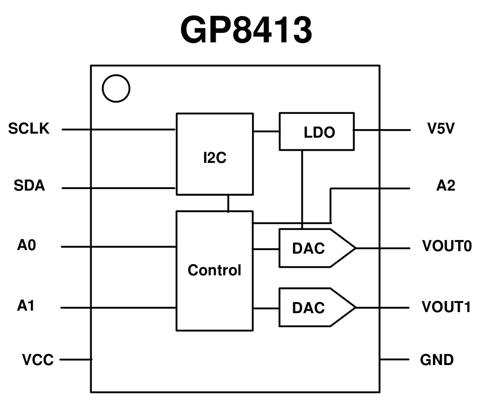

Info taken from datasheet, translated to English (EvdO May 29, 2025)

## Features
*   The GP8413 linearly converts digital data via an I2C interface into two analog voltage outputs, selectable as 0-5V or 0-10V.
*   A single I2C interface supports up to 8 GP8413 devices connected in parallel, selected using a 3-bit hardware address (A2/A1/A0).
*   `VOUT = 5V * DATA / 0x7FFF` or `VOUT = 10V * DATA / 0x7FFF`
*   Input data range: 15-bit, 0x0000 to 0x7FFF
*   I2C input signal high level (VIH): 2.7V to 5.5V
*   Output voltage error: < 0.2%
*   Output voltage linearity error: 0.01%
*   Output short-circuit protection: The chip enters protection mode and stops output when an output pin is shorted to ground.
*   Power supply voltage: 9V – 36V (internal LDO will create reference and output 5 volt on pin, add bypass cap of 1uF)
*   Power consumption: < 5mA
*   Startup time: < 2ms
*   Operating temperature: -40°C to 85°C

## Description
The GP8413 is an I2C to analog signal converter (DAC). 
This chip linearly converts 15-bit digital data (0x0000 to 0x7FFF) into two independent analog voltage outputs, selectable as 0-5V or 0-10V. 
The output voltage error is less than 0.2%, and the linearity error is 0.01%.

## Applications
*   General-purpose signal conversion
*   Motor speed control, LED dimming
*   Inverters, Power supplies
*   Industrial analog signal isolation


## 1. Pin Definitions

| Pin Name | Pin Function                                                                       |
| :------- | :--------------------------------------------------------------------------------- |
| SCLK     | I2C protocol clock signal                                                          |
| SDA      | I2C protocol data signal                                                           |
| VCC      | Power Supply                                                                       |
| GND      | Ground                                                                             |
| V5V      | Internal LDO, 5V output. An external capacitor greater than 1uF must be connected. |
| A0       | Hardware address bit 0                                                             |
| A1       | Hardware address bit 1                                                             |
| A2       | Hardware address bit 2                                                             |
| VOUT0    | First analog voltage output. An external 0.1uF capacitor must be connected.        |
| VOUT1    | Second analog voltage output. An external 0.1uF capacitor must be connected.       |

*Table-A Pin Distribution*
```
GP8413
           ___ 
SCLK  1 --|*  |-- 10 V5V
SDA   2 --|   |-- 9  A2
A0    3 --|   |-- 8  VOUT0
A1    4 --|   |-- 7  VOUT1
VCC   5 --|___|-- 6  GND
```



## 2. Absolute Maximum Ratings

| Parameter                        | Value               |
| :------------------------------- | :------------------ |
| Industrial Operating Temperature | -40°C to 85°C       |
| Storage Temperature              | -50°C to 125°C      |
| Input Voltage                    | -0.3V to VCC + 0.3V |
| Maximum Voltage                  | 36V                 |
| ESD Protection                   | > 2000V             |

* Exceeding the parameter values listed in "Absolute Maximum Ratings" may cause permanent damage to the device. Operation of the device under conditions beyond those listed in the specifications is not guaranteed. Prolonged exposure to extreme conditions may affect device reliability or functionality.

Original datasheet is not clear about register numbers or values for setting range.
Writing to EEPROM does not comply with I2C standards, needs special bit bang driver to make it work on ESP32.
